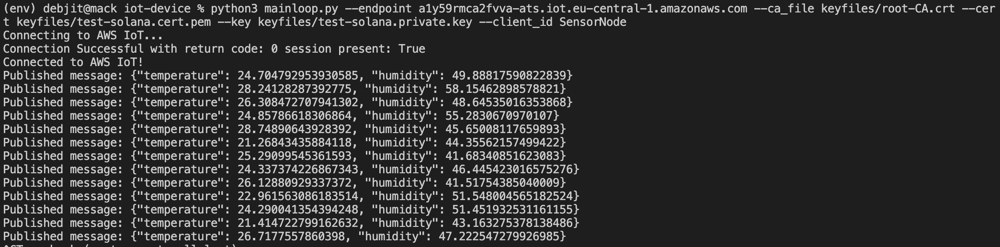

# IoT on Solana

This projects demonstrates how to use Solana to build an IoT application. We aggregate weather data from multiple sensor nodes and publish them as a data feed on Solana. The data feed can be consumed by any client application.

## Architecture

The architecture of the IoT application is as follows:
- The Sensor Nodes collect weather data (dummy data for this project) and sends it over MQTT to the Broker
- Along with the MQTT client code, each sensor node also implements a CoAP server to provide specific data to any requesting client
    - A personal note is that the CoAP server is not necessary for this project, because we are using MQTT to send data to the broker anyways, and additional complexity adds unnecessary overhead
- The Broker is AWS IoT Core, which receives the data from the sensor nodes and triggers a Lambda function to publish the data to Solana
- The Lambda function is written in Python and uses the Solana Python SDK to publish the data to our Solana smart contract
- The Solana smart contract is a simple program that stores the data in a data feed as a struct, which keeps updating with the latest data

## Setup

#### SMART CONTRACT
The [smart contract](solana-contracts/src/lib.rs) is already deployed on the Solana Devnet. The program ID is [`815ZrwvtXyVMWeVfunYVDXSvBQ13nNrKr671PbtNGZvm`](https://explorer.solana.com/address/815ZrwvtXyVMWeVfunYVDXSvBQ13nNrKr671PbtNGZvm?cluster=devnet).

#### LAMBDA FUNCTION
The [Lambda function](aws-lambda/lambda_function.py) to interact with the Solana smart contract is written in Python. The function is triggered by the AWS IoT Core rule engine, which is set up to respond to the MQTT topic `weather/data`. The function reads the data from the MQTT message and sends it to the Solana smart contract using the Solana Python SDK.

#### SENSOR NODE

The [sensor node](iot-device/mainloop.py) is a Python script that simulates a sensor node. It generates random weather data and sends it to the AWS IoT Core MQTT broker. This is meant to be run on the actual sensor node hardware.

The file also contains a CoAP server implementation, which I believe is not necessary for this project, however, it is included for reference.

## Working

1. The sensor node generates random weather data and sends it to the AWS IoT Core MQTT broker.

```py
temperature = random.uniform(20, 30)
humidity = random.uniform(40, 60)
data = {
    "temperature": temperature,
    "humidity": humidity
}
message_json = json.dumps(data)
mqtt_connection.publish(
    topic="weather/data",
    payload=message_json,
    qos=mqtt.QoS.AT_LEAST_ONCE
)
```

2. The AWS IoT Core Thing was setup and the policies was setup to accept relevant connections.


<center>Thing created in AWS IoT Core</center>


<center>AWS IoT Policy</center>

3. The AWS IoT Core rule engine triggers the Lambda function when it receives data on the `weather/data` topic.


4. The Lambda function reads the data from the MQTT message and sends it to the Solana smart contract.

```py
# Create the transaction
transaction = Transaction().add(transaction_instruction)

# Send the transaction
response = client.send_transaction(transaction, payer)
```

> Note: Next is the main part which you need to run. Till now, everything was setup and deployed.

5. To run the sensor node which generates dummy data and publishes it to MQTT and makes it available through a CoAP server, you need to just build the Docker image and run it.

```sh
cd iot-device
docker build -t iot-device .
docker run iot-device
```


<center>Messages published by the sensor node</center>


<center>Messages received</center>

## Minor Hiccup

Since I haven't triggered Solana contract calls from Python before, there were issues with the Python SDK. Due to some architecture incompatibility, the `solders` library was not able to send transactions.


<center>Lambda error logs</center>

Here you can see the invalid ELF header error. While I debugged several other issues throughout the project, this was the final one that I couldn't resolve due to time issues as I was asked to submit the project within a day.

## Conclusion

Solana is a fast and low-cost blockchain platform, making it ideal for IoT applications. The architecture presented in this project demonstrates how we can aggregate data across multiple sensor nodes and publish it to Solana as a data feed, in a distributed manner.